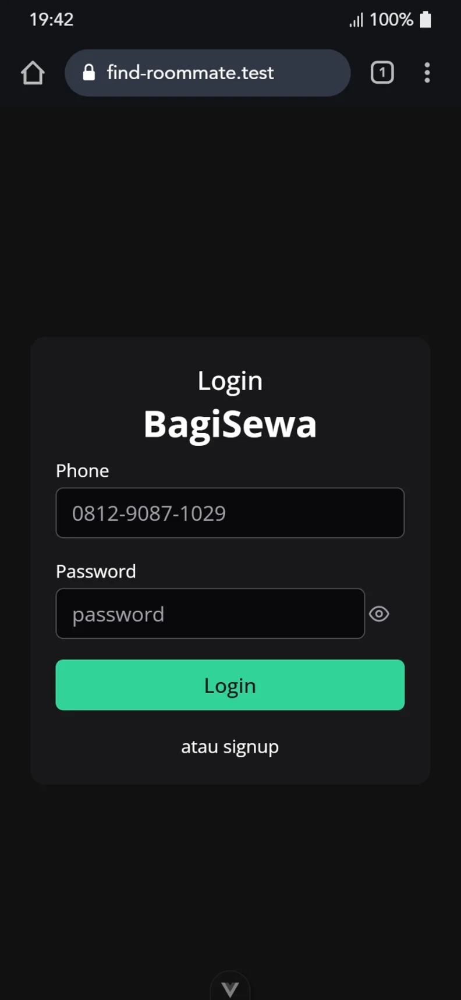
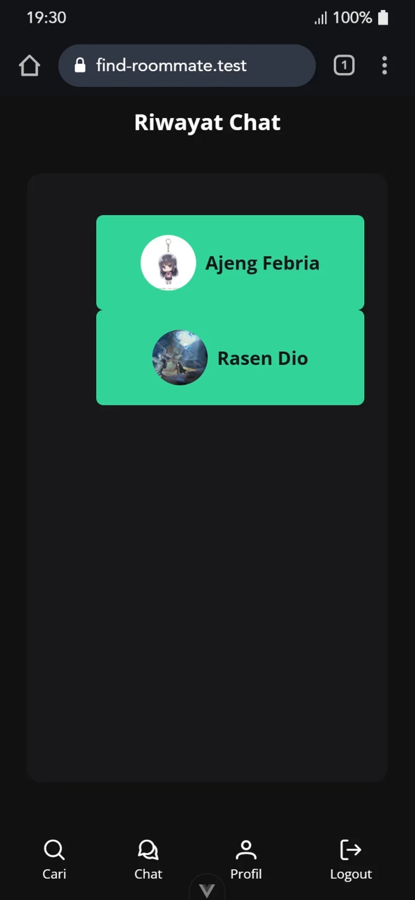
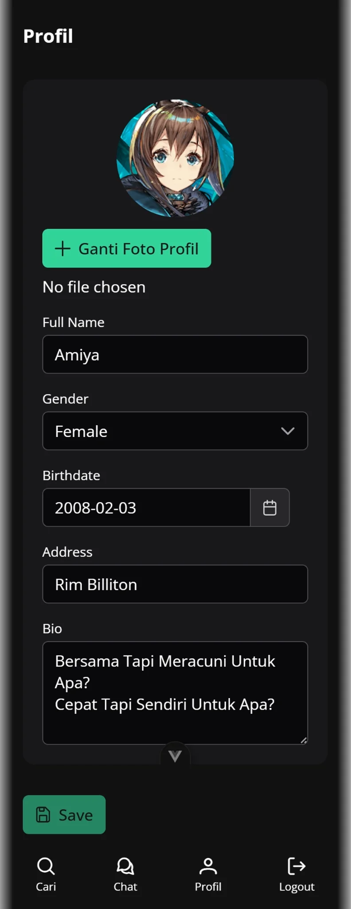

# Find Roommate

A platform for user to find a friend with whom to share their lodging rent with. The user may specify the criteria of the desired "roommate" from age, gender, bio, etc.

---
Note: this is only the frontend part of the platform. It is meant to be connected with [the API](https://github.com/Ikhwanu-Robik/find-roommate-api)

---

## Features

- login and signup with phone number
- edit profile
- find a roommate by specifying criteria
- chat with potential roommate
- a minimap to choose lodging place criterion

## Tech Stacks

- Vue
- Vue Router
- Primevue
- Leaflet + Openstreetmap

## Screenshots

### Login Page


### Roommate Criteria Form


### Chat Pages



### Edit Profile Page


## Project Setup

```sh
npm install
```

### Compile and Hot-Reload for Development

```sh
npm run dev
```

### Compile and Minify for Production

```sh
npm run build
```
